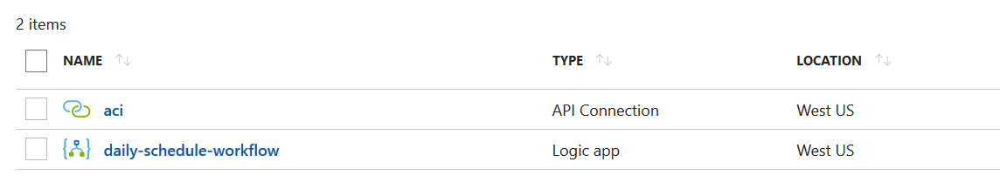
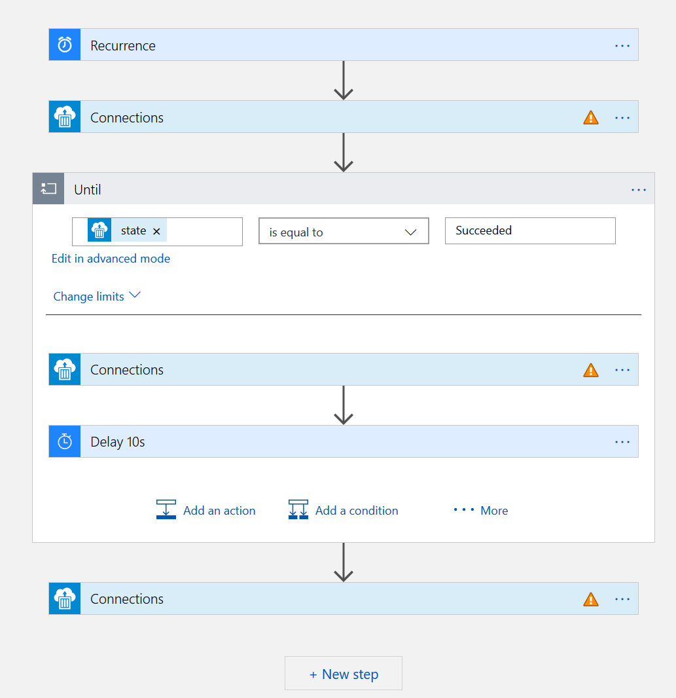
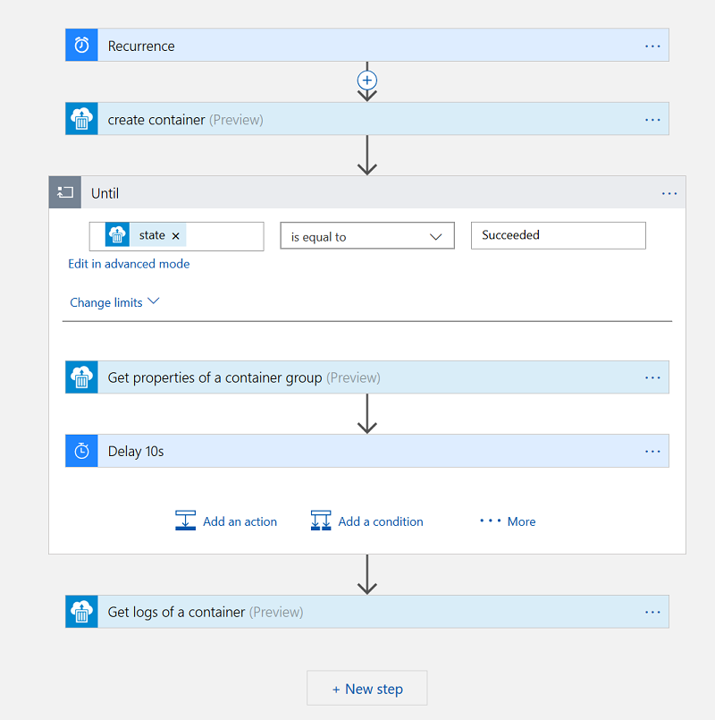

# Introduction 
A simple tool that aggregates Azure compute usage across multiple subscriptions. Output as JSON or ascii tables to console.

Sample output:

### Subscription Usage
| resource          | eastus   | westus2  | total    |
|-------------------|----------|----------|----------|
| availabilitySets  | 1        | 0        | 1        |
| cores             | 1        | 1        | 2        |
| virtualMachines   | 1        | 1        | 2        |

# Getting Started
```
Usage: azusage [options] [command]

Options:
  -?|-h|--help               Show help information
  -t|--tenant                The Azure tenant Id to sign in.
  -c|--client                Service principal client Id for accessing Azure subscriptions.
  -s|--secret                Service principal client secret for accessing Azure subscriptions.
  -o|--output                Output format: Json, Table, Markdown or Csv.
  --title                    Table and Markdown output title. Ignored in JSON output.
  -n|--usage-name            Show only specified usages, e.g. cores. Can specify multiple values.
  -p|--subscription-pattern  Show only specified subscriptions, support regex. Can specify multiple values.
  --access-token             Specify Azure Resource Manager access token directly. Service principal will be ignored in this case.

Commands:
  list     Lists subscription usages by individual subscriptions.
  summary  Summarize subscription usages by name groups.

Use "azusage [command] --help" for more information about a command.
```

### Run the tool inside Azure Cloud Shell
1. Open Cloud Shell [](https://shell.azure.com)
2. Run following command to run the container in Azure Container Instance. Output will be print in container logs.

```
az container create -g demo -n azusage \
        --restart-policy Never \
        --image yangl/azure-usage:alpine \
        --command-line "dotnet azusage.dll summary --output table --access-token `az account get-access-token | jq .accessToken -r`"
az container logs -g demo -n azusage
```

### Run the tool on local machine using Docker & service principal credential:

```
docker run yangl/azure-usage:alpine summary --output table --client <sp-client-id> --secret <sp-secret> --tenant <tenant-id>
```

### Run the container in Azure with webhook or timer
To run this tool in Azure automatically we will use Azure Container Instances and Logic App. We will need create a Logic App workflow with a timer that triggers every day, the workflow will start an ACI container and wait it run to completion, then get output from container logs. The output can be saved to a storage blob using storage connector, or send email via outlook/gmail connector.

All we need is 2 steps:

1. Deploy a logic app workflow and an API connection to ACI. Run following command in Azure Cloud Shell.

```
az group create -l westus -n azure-usage-report
az group deployment create -g azure-usage-report -n task --template-uri https://raw.githubusercontent.com/yangl900/azure-usage/master/Templates/schedule-daily.json --parameters client_secret=mysecret client_id=my_spn_client_id tenant_id=my_tenant_id
```

2. Login your account to connect Logic App and Azure Container Instance

After the deployment complete you should see 2 resources in the resource group from Azure Portal:


Open the logic app workflow resource, and in the designer (click Edit) you should see following flow:


Click the ones with warning and sign in your account (or, use a service principal), this will allow the workflow to create container. And that's it! Should see the final workflow like following:



# Build and Test
Build from commandline where .Net Core SDK available:
```
dotnet build
```

# Contribute
Contributions are welcome.
